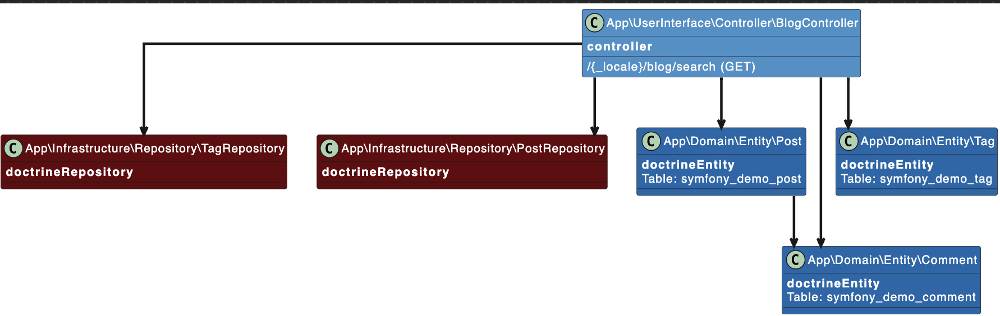

Symfony Cartography bundle
========================


The aim of this bundle is to:
- provide an analysis of your project code bases (classes, class categorization, method calls to other service/class)
- draw a map of all possible method calls from and to a specific class::method. be ware that this map is calculated through static analysis, it's not the classes:methods called during a specific execution, it's all the possible calls from and to a class:method




 
Requirements
------------

  * PHP 8.1.0 or higher;
  * PDO-SQLite PHP extension enabled for development;

Installation
------------
```bash
composer require --dev micoli/symfony-cartography
```
- 
- add the line in `config\bundles.php`

```
Micoli\SymfonyCartography\SymfonyCartographyBundle::class => ['dev' => true, 'test' => true],`
```

- add a route in `config/routes.yaml`

```
when@dev:
    _symfony_cartography:
        resource: '@SymfonyCartographyBundle/Resources/config/routes.yaml'
        prefix: /_cartography
```

- and create `config/packages/symfony_cartography.yaml`

[//]: <> (include-placeholder-start "./TestApplication/config/packages/symfony_cartography.yaml")
```
symfony_cartography:
  enabled: true
  sources:
    - '%kernel.project_dir%/src'
  filters:
    classes:
      rules:
        - '+App\' # all classes in namespace 'App\' will be excluding
        - '-App\Domain\DataFixtures' # except those starting by 'App\Domain\DataFixtures'
    method_calls:
      exclude_loopback: true #display sameClasse to sameClasse arrows
      rules:
      - '-Twig\' # do not display call towards classes in 'twig' namespace
      - '-ReflectionFunctionAbstract'
      - '-Doctrine\'
      - '-Symfony\'
      - '-Webmozart\'
      - '-Psr\'
  messenger_dispatchers: # Class/Method used to wire event trough messenger buses
    - class: App\Infrastructure\Bus\MessengerCommandBus
      method: dispatch
    - class: App\Infrastructure\Bus\MessengerEventDispatcher
      method: dispatch
  graph:
    engine: visjs # visjs|plantuml|cytoscape
    engine_uri: https://kroki.io/plantuml/svg
#    engine_uri: http://127.0.0.1:8080/svg # if local plantuml server
    withMethodDisplay: false # display methods in classes
    withMethodArrows: false # if disabled, only one arrow from a class to another is draw
    leftToRightDirection: false # if disabled graph is drawn top to bottom, else it is draw left To Right
  colors: # colors used in graph
      - class: !php/enum Micoli\SymfonyCartography\Service\Categorizer\ClassCategory::undefined
        color: '#033270'
      - class: !php/enum Micoli\SymfonyCartography\Service\Categorizer\ClassCategory::doctrineEntity
        color: '#1368aa'
      - class: !php/enum Micoli\SymfonyCartography\Service\Categorizer\ClassCategory::controller
        color: '#4091c9'
      - class: !php/enum Micoli\SymfonyCartography\Service\Categorizer\ClassCategory::messengerCommandHandler
        color: '#9dcee2'
      - class: !php/enum Micoli\SymfonyCartography\Service\Categorizer\ClassCategory::messengerEventListener
        color: '#fedfd4'
      - class: !php/enum Micoli\SymfonyCartography\Service\Categorizer\ClassCategory::messengerEvent
        color: '#f29479'
      - class: !php/enum Micoli\SymfonyCartography\Service\Categorizer\ClassCategory::messengerCommand
        color: '#f26a4f'
      - class: !php/enum Micoli\SymfonyCartography\Service\Categorizer\ClassCategory::symfonyConsoleCommand
        color: '#ef3c2d'
      - class: !php/enum Micoli\SymfonyCartography\Service\Categorizer\ClassCategory::symfonyEventListener
        color: '#cb1b16'
      - class: !php/enum Micoli\SymfonyCartography\Service\Categorizer\ClassCategory::doctrineRepository
        color: '#65010c'
      - class: !php/enum Micoli\SymfonyCartography\Service\Categorizer\ClassCategory::symfonyEvent
        color: '#f29479'

```
[//]: <> (include-placeholder-end)


Usage
-----
- in `webProfiler` toolbar you can see a preview of the call graph from the current controller

- in `webProfiler` page a new section called `cartography` is present


- To clear inner psalm cache and refresh analysedCodebase 
`bin/console code:cartography --force`

[//]: <> (command-placeholder-start "bin/console code:cartography --force")
```
Analysing
enrichedClasses: 56
methods: 25
method calls: 73
interfaceImplements: 34
classInterfaces: 35
Analyse done
```
[//]: <> (command-placeholder-end)

- To use a local instance of plantuml
`docker run -d -p 8080:8080 plantuml/plantuml-server:jetty`
and in `config/packages/symfony_cartography.yaml`
set
    ```
    symfony_cartography:
      graph:
        engine: plantuml
        engine_uri: http://127.0.0.1:8080/svg
    ```
- else to use a public instance of kroki
    ```
    symfony_cartography:
      graph:
        engine: plantuml
        engine_uri: https://kroki.io/plantuml/svg
    ```

- Tests
-----

Execute this command to run tests:

```bash
$ make tests-all
```

# Todo
-----

- manage symfony events and handler
- manage symfony services
- indirect from interfaces or use service definitions
- get called tree and calling tree

